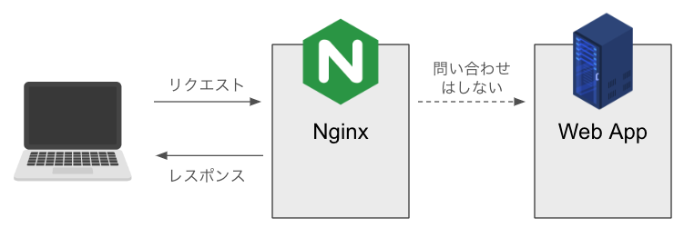

<br/>
<br/>
<br/>
<br/>
<br/>

# ISUCON 研修おかわり会

## パフォーマンスチューニングを始めよう

**[paki & yata]**

---

## 本日の流れ（アジェンダ）

1.  (10 分) Part 1: ISUCON振り返り会の概要
2.  (10 分) Part 2: 計測、特定、改善
3.  (20 分) Part 3: 改善 ① データベース (インデックス)
4.  (15 分) Part 4: 改善 ② Web サーバー (静的ファイル)
5.  (25 分) Part 5: 改善 ③ アプリケーション (N+1 問題)
6.  (10 分) まとめと Q&A

インタラクティブに進めていきましょう！
**講義** → **グループディスカッション** → **ハンズオン**

---

## Part 1: ISUCON振り返り会の概要
(15 分)

---

## 🧑‍💻 自己紹介

- **講師:** kazu-gor


---

## 🧑‍💻 自己紹介

- **講師:** yata


---

## 🤝 [グループ] 自己紹介タイム (3 分)

- お名前（ハンドルネーム）
- ISUCON 参加経験はありますか？
- 今日学びたいこと

同じグループの方と、軽くで良いので話してみましょう！

---

## ISUCON とは？

**I**ikanjini **S**peed **U**p **CON**test

> お題となる Web サービスを決められたレギュレーションの中で限界まで高速化を図るチューニングバトル

- DB やアプリケーション、OS などをガチャガチャする
- 仕様さえ守っていれば何でもあり！**とにかく速く！**
- バックエンド、インフラの知識を総動員して立ち向かう競技

---

## 🎯 本日のゴール

- **MUST**
  - ISUCON の基本的な流れ **計測 → 特定 → 改善** のサイクルを理解する
  - `private-isu` を題材に、自力で **1 つ以上** の改善を体験する
- **BETTER**
  - ログを読み解き、適切な改善アクションを **自分で考えて実行できる** ための基礎を築く

---

## 環境構築について

- 事前課題でアナウンスしていた通り、AWSの環境を使用します。
- **CloudFormation** というサービスを使うことで全員が同じ構成のサーバーを簡単に作成できます。
- まだ環境構築できていない人🖐️は、後ほど一緒にやりましょう！

---

<br/>
<br/>
<br/>
<br/>
<br/>

## Part 2: 計測、特定、改善

### ISUCON の基本的な流れを勉強しよう

(20 分)

---

## 推測するな、計測せよ (Don't guess, measure.)

パフォーマンスチューニングの鉄則です。

- **なぜ？**
  - 勘や思い込みでの修正は、**的外れ**だったり、時には**悪化**させることさえある。
- **どうするか**
  - 今一番ボトルネックになっている場所を見つけて、そこに適切なアプローチを取る
  - 計測 → 特定 → 改善のサイクルを一つずつ積み上げていく

---

## 基本的な２つのボトルネック

- データベース
  - データの取得、挿入がボトルネックになりがち
  - 一つ一つは軽くても蓄積するとかなりのボトルネックに
  - 0.1 秒で処理できるクエリも 10000 回叩かれたら 10 秒かかる
- アプリケーション
  - これも実質データベースのボトルネック
  - データを無駄に取得していたり、何回も取得しているとレスポンスが遅くなる

---

## じゃあどっちが問題かってどうすれば分かる？

- まずは top コマンドで CPU の使用量を見よう
- CPU の使用料が多い方に問題がありそう！と見当を付けられる

---

## 実際に見てみよう

---

## 計測の三種の神器

本日は代表的な 2 つのツールを使います。

1.  **アクセスログ解析: `alp`**
    - どのエンドポイント（URL）が **遅いか** / **たくさん呼ばれているか** を教えてくれる。
2.  **スロークエリログ解析: `pt-query-digest`**
    - どの SQL クエリが **実行に時間がかかっているか** を教えてくれる。
3.  **(今回は使いませんが) アプリケーションのプロファイラ**
    - どの関数/処理が **CPU やメモリを消費しているか** を教えてくれる。

---

## [ハンズオン] 計測の準備

まず、初期状態の性能を測ってみましょう。

1.  **ログファイルをリセット**

    - 過去のログを消して、ベンチマーク実行中のログだけを記録できるようにします。

```bash
# SSHしているサーバー上で実行
sudo mv /var/log/nginx/access.log /var/log/nginx/access-$(date +%Y%m%d%H%M).log
sudo mv /var/log/mysql/mysql-slow.log /var/log/mysql/mysql-slow-$(date +%Y%m%d%H%M).log
```

---

2.  **ベンチマーカーの実行**

```bash
/home/isucon/private_isu/benchmarker/bin/benchmarker -u /home/isucon/private_isu/benchmarker/userdata -t http://localhost
```

3.  **初期スコアを確認**
    - おそらく `3,000` 点前後のスコアが出るはずです。この数値を覚えておきましょう。

---

## [ハンズオン] アクセスログ解析 with `alp`

どの **Web リクエスト** がボトルネックか見てみましょう。

```bash
# alpコマンドの実行
# nginxのログフォーマットに合わせてltsv形式でパース
alp json --file /var/log/nginx/access.log --sort sum -r
```

---

## 出力例

```
+-------+-----+-----+-----+-----+-----+-------+--------+------------------+
| COUNT | 1% | 50% | 99% | AVG | MAX | SUM | METHOD | URI |
+-------+-----+-----+-----+-----+-----+-------+--------+------------------+
| 1800 | ... | ... | ... | 0.82| 1.51| 1476.0| GET | / |
| 1200 | ... | ... | ... | 0.55| 1.10| 660.0| GET | /posts?offset=10 |
| 600 | ... | ... | ... | 0.30| 0.80| 180.0| POST | /login |
| ... | ... | ... | ... | ... | ... | ... | ... | ... |
+-------+-----+-----+-----+-----+-----+-------+--------+------------------+
```

SUM (合計時間) や AVG (平均時間) が大きいところが怪しい！

---

## [ハンズオン] スロークエリログ解析 with pt-query-digest

どの SQL クエリ がボトルネックか見てみましょう。

```bash
# pt-query-digest コマンドの実行
sudo pt-query-digest --limit 5 --explain h=localhost,u=isuconp,p=isuconp,D=isuconp /var/log/mysql/mysql-slow.log
```

---

## 出力例 (一部抜粋):

```
# Query 1: 0.01 QPS, 0.01x concurrency, ID 0x...
# This item is included in the report because its total time is ...
# Scores: V/M = 0.01
# Time range: ... to ...
# Attribute    pct   total     min     max     avg     ...
# ============ === ======= ======= ======= ======= =======
# Count         50    1800
# Exec time     63   5225s      2s      4s      3s   ...
# ...
SELECT `posts`.* FROM `posts` ORDER BY `created_at` DESC LIMIT 10 OFFSET 10;

# Query 2: ...
SELECT `comments`.* FROM `comments` WHERE `post_id` = ? ORDER BY `created_at` DESC;
```

Exec time (合計実行時間) が大きいクエリが怪しい！

---

## [グループ] ボトルネックはどこだ？ (5 分)

alp の結果と pt-query-digest の結果を見てみましょう。
最も改善効果が高そうなのはどのリクエスト/クエリですか？
なぜそう思いましたか？
グループで議論して、仮説を立ててみてください。
議論のヒント:

- / (トップページ) の表示が遅い？
- 特定の SQL が何度も実行されている？
- 遅い SQL と、遅い Web リクエストに関連はある？

--- 

## Part 3: 改善①- データベース (インデックス)

(20 分)

---

## インデックス (Index) とは？

**データベースの検索を高速にするための「索引」** です。

- **例：分厚い技術書**
  - **インデックスなし:** "N+1 問題" のページを探すのに、最初から全ページをめくる必要がある ( **= フルテーブルスキャン** )
  - **インデックスあり:** 巻末の索引で "N+1 問題" を引き、該当ページ番号をすぐに見つけられる ( **= インデックススキャン** )

`WHERE`句や`ORDER BY`句で頻繁に使われるカラムにインデックスを貼ると効果的です。

---

## `EXPLAIN` で実行計画を見る

SQL がどのように実行されるか（インデックスを使うかなど）を DB に問い合わせるコマンドです。

```sql
EXPLAIN SELECT * FROM comments WHERE post_id = 12345;
```

出力例のチェックポイント:

- type:
  - ALL: ヤバい！ フルテーブルスキャン。インデックスが効いていない。
  - ref, range, index: インデックスが使われている。良い。
- rows:スキャンすると予測される行数。この数が少ないほど良い。
- Extra:
  - Using filesort: 注意！ ディスク上でソートが発生している。ORDER BY 句で指定したカラムにインデックスがない場合に発生しやすい。

---

## [グループ] どこにインデックスを貼る？ (5 分)

再度 pt-query-digest やtopコマンドを使用して結果を見てみましょう。

### 議論のポイント:

Exec time が長いクエリはどれか？
そのクエリの WHERE 句や ORDER BY 句で使われているカラムは？
EXPLAIN を実行してみて、type: ALL や Extra: Using filesort になっていないか？

---

```sql
-- 例: このクエリが遅い場合
SELECT \* FROM posts ORDER BY created_at DESC;
-- created_at にインデックスは必要？

SELECT \* FROM comments WHERE post_id = ?;
-- post_id にインデックスは必要？
```

---

## [ハンズオン] インデックスを追加しよう

議論で特定したカラムにインデックスを追加します。
private-isu では、posts テーブルの created_at と、comments テーブルの post_id が効果的です。

- MySQL にログイン

```bash
mysql -u isudb -p isudb
# パスワードは isudb
```

- インデックスを追加する SQL を実行

```sql
alter table comments add index post_id_idx(post_id);
```

ベンチマークを再度実行し、スコアの変化を確認しましょう！
EXPLAIN の結果も変わっているはずです。

---

## Part 4: 改善 ② - Web サーバー (静的ファイル)

(15 分)

---

## 静的ファイル vs 動的ファイル

- **静的ファイル (Static Files)**
  - 誰がいつアクセスしても **内容が変わらない** ファイル。
  - 例: CSS, JavaScript, 画像ファイル (JPG, PNG)
- **動的ファイル (Dynamic Content)**
  - アクセスごとにプログラムが実行され、**内容が変わる** ファイル。
  - 例: ユーザーの投稿一覧、ログイン後のマイページ

---

## **現状の`private-isu`**

全てのアクセスを一度 Go アプリケーションが受け取ってから処理している。
静的ファイルまでアプリケーションが処理するのは **非効率**！

---

## リバースプロキシとは？

通常のプロキシはクライアント側に設置されますが、**リバースプロキシ**はその逆で**Webサーバー側**に設置されるため、この名前で呼ばれます。

**役割:**
- クライアントとサーバーの間に位置し、通信の中継や制御を行う
- クライアントからのリクエストを受け取り、適切なバックエンドサーバーに転送

**主な機能:**
- **キャッシュ機能**: 頻繁にアクセスされるコンテンツや静的ファイルをキャッシュ
- **負荷分散**: 複数のバックエンドサーバーへリクエストを振り分け
- **セキュリティ**: バックエンドサーバーを直接公開せず保護

---

## Nginx による静的ファイル配信

Web サーバー (Nginx) が、静的ファイルへのリクエストを直接処理し、アプリケーション(Go)に渡さないようにする。

**メリット**

- アプリケーションの負荷が減り、動的コンテンツの処理に専念できる。
- Web サーバーはファイル配信が得意なので、高速に応答できる。



---

## [ハンズオン]ログを集計してみよう

再度ログを集計してみましょう。

その前に古いアクセスログを移動しておきます。

```bash
# 今までのアクセスログを移動
sudo mv /var/log/nginx/access.log /var/log/nginx/access.log.old
# nginxのreload
sudo systemctl reload nginx
```

---

## [ハンズオン]アプリケーションのログを集計してみる

ベンチマーカーを実行して、アクセスログを集計します。

```bash
# ベンチマーカーを走らせるための、スコア計測用コマンド
/home/isucon/private_isu/benchmarker/bin/benchmarker -u /home/isucon/private_isu/benchmarker/userdata -t http://localhost
```

```bash
# 集計用のコマンド
sudo cat /var/log/nginx/access.log | alp ltsv -m '/image/[0-9]+,posts/[0-9]+,/@\w+' -o method,uri,avg,count,sum --sort sum
```

ここからなにがわかるでしょうか？

---

## [グループ] どこを修正する？ (3 分)

- 設定ファイル: `/etc/nginx/nginx.conf`
- どの部分に、どのような設定を追加すれば良いでしょうか？

ヒント: `location` ディレクティブを使って、特定のパスへのリクエストを処理します。

```nginx
# /etc/nginx/nginx.conf の http.server ブロック内

server {
    listen 80;
    server_name localhost;

    # ... このあたりに追記 ...

    location / {
        proxy_pass [http://127.0.0.1:8080](http://127.0.0.1:8080); # アプリケーションに渡す
    }
}
```

---

## [ハンズオン] アプリケーションのパフォーマンス改善

設定ファイルを開き、[isucon.conf の設定ファイル](/lecture/part3/static_file.conf)を参考にして、
静的ファイルの配信を設定してみましょう。

完了したら下記のコマンドで設定を反映します。

```bash
# 設定ファイルの文法チェック
sudo nginx -t
# nginxのreload
sudo systemctl reload nginx
```

---

## リバースプロキシのキャッシュ機能

Nginxをリバースプロキシとして使う場合、**キャッシュ機能**が大きなメリットになります。

**なぜキャッシュが効果的？**
- 頻繁にアクセスされるコンテンツをNginxが保持
- バックエンドのアプリケーションサーバーまで行かずに、Nginxから直接レスポンスを返せる
- 結果: **レスポンス時間の短縮**と**サーバー負荷の軽減**

**private-isuでの例:**
- 画像ファイル（`/image/`）
- 静的ファイルをNginxでキャッシュすることで、パフォーマンスが向上！

---

## [ハンズオン] 画像をキャッシュする

設定ファイルを開き、[isucon.conf の設定ファイル](/lecture/part4/static_file.conf)を参考にして、
静的ファイルの配信を設定してみましょう。

完了したら下記のコマンドで設定を反映します。

```bash
# 設定ファイルの文法チェック
sudo nginx -t
# nginxのreload
sudo systemctl reload nginx
```

---

<br/>

# Part 5: 改善 ③- アプリケーション (N+1 問題)
(25 分)

---

## N+1問題ってなに？🤔

**「1つのデータを取るために、1回＋N回もデータベースに問い合わせちゃう問題」**

#### ファミレスで例えると...

あなたはファミレスの店員です。5人のお客さんが来店しました。

❌ **N+1問題が起きている状態：**
1. 「1人目は何を注文した？」→ 厨房に伝えに行く（1回目）
2. 「2人目は何を注文した？」→ 厨房に伝えに行く（2回目）
3. 「3人目は..

**合計5回も厨房を往復！疲れる！時間がかかる！非効率！**

---

## じゃあどうする？

✅ **解決した状態：**
1. 「全員分の注文を承ります！」→ 厨房に1回行くだけ

---

## コードで見るN+1問題

```go
// ❌ N+1問題が発生するコード
// 1回目のクエリ
posts, _ := db.Query("SELECT * FROM posts")
for posts.Next() {
    var post Post
    posts.Scan(&post.ID, &post.Title)
    
    // ループの中でクエリが発生！（N回）
    comments, _ := db.Query("SELECT * FROM comments WHERE post_id = ?", post.ID)
    count := 0
    for comments.Next() {
        count++
    }
    fmt.Printf("%s has %d comments\n", post.Title, count)
}
// → 投稿が100件あったら、101回もデータベースと通信！
```

for文の中で何度もDBに問い合わせをしている。

---

## N+1問題はわかったけどなにがいけないの？

ループ処理をするたびにDBに問い合わせする
→ 10件ぐらいなら毎回探索してもそこまで負荷にはならなさそう
→ 100,000件あったら何回も100,000件に対して欲しいデータを探しにいく？

想像できる通り、DBのパフォーマンスが悪化して以下のような事態に。

👤 ユーザ：「なんかこのサイト重くない？」
👤 開発者：「なんかDBのリソースめっちゃ使ってない？」

**これはISUCONに限った話ではありません。**
**実際の開発でも気を抜くと起こり得ます。**

---

## ではN+1問題をどうやってみつけるか

「理解したよ、SQLがfor文の中で大量に呼ばれている場所を探すんだよね？」

---

## 違います、計測してください。

---

## N+1問題の発見方法 🔍

### ログで発見する(pt-query-digest)

```bash
sudo pt-query-digest --limit 5 --explain h=localhost,u=isuconp,p=isuconp,D=isuconp /var/log/mysql/mysql-slow.log
```

**こんな症状が見つかったら要注意！**
- 同じようなクエリが大量に発行されている
- `SELECT * FROM comments WHERE post_id = ?` が1000回とか...
- 合計実行時間（Exec time）がやたら長い

---

## [グループ] `private-isu`の N+1 を探せ！ (5 分)

`alp` の結果で遅かった `/` (トップページ) の処理を見てみましょう。
ソースコードは `/home/isucon/private_isu/webapp/golang/app.go` にあります。

```go
// /home/isucon/private_isu/webapp/golang/app.go

// トップページのハンドラー
func getIndex(w http.ResponseWriter, r *http.Request) {
    // 投稿を取得
    results := []Post{}
    err := db.Select(&results, "SELECT * FROM `posts` ORDER BY `created_at` DESC LIMIT ?", postsPerPage)
    
    for i := 0; i < len(results); i++ {
        // この中で何をしている？
        err := db.Get(&results[i].User, "SELECT * FROM `users` WHERE `id` = ?", results[i].UserID)
        
        // コメント数を取得
        var count int
        db.Get(&count, "SELECT COUNT(*) FROM `comments` WHERE `post_id` = ?", results[i].ID)
        results[i].CommentCount = count
        
        // コメントを取得
        comments := []Comment{}
        db.Select(&comments, "SELECT * FROM `comments` WHERE `post_id` = ? ORDER BY `created_at` DESC LIMIT 3", results[i].ID)
        for j := 0; j < len(comments); j++ {
            db.Get(&comments[j].User, "SELECT * FROM `users` WHERE `id` = ?", comments[j].UserID)
        }
        results[i].Comments = comments
    }
    // ...
}
```

---

## [ハンズオン] N+1 問題を修正しよう

トップページの処理を改善します。
コメントやユーザー情報をまとめて取得し、ループ内での SQL 発行をなくしましょう。

修正方針:

1. 取得した posts の id と user_id を集める。
2. IN 句を使って、comments と users を一括で取得する。
3. Map を使って、Post に Comment や User を効率的に紐付ける。

```go
// 例: IN句を使った一括取得
postIDs := []int{1, 2, 3, 4, 5}
query := "SELECT * FROM comments WHERE post_id IN (?, ?, ?, ?, ?)"
db.Select(&comments, query, postIDs...)

// MapでO(1)アクセスを実現
userMap := make(map[int]User)
for _, u := range users {
    userMap[u.ID] = u
}
```

---

## [ハンズオン] デプロイと再計測

### アプリケーションを再起動

```bash
# Go アプリケーションを再起動

sudo systemctl restart isu-go
```

### ベンチマークを再実行

ブラウザでベンチマークを実行し、スコアの変化を確認します。
ログを再度 alp や pt-query-digest で見てみましょう。
SELECT \* FROM comments WHERE post_id = ? のようなクエリが減っているはずです。
スコアは上がりましたか？ 🎉

---

## まとめと Q&A

(10 分)

---

## 📈 スコアの Before / After

| 改善内容               | スコア（目安） | 備考                                 |
| :--------------------- | :------------- | :----------------------------------- |
| **初期状態**           | ~ 3,000        |                                      |
| **インデックス追加後** | ~ 30,000       | DB のボトルネックも解消              |
| **静的ファイル配信後** | ~ 40,000       | アプリの負荷を下げて安定化           |
| **N+1 問題修正後**     | ~ 60,000+      | アプリケーションの改善が大きく効く！ |

※スコアは環境やタイミングで変動します。

**重要なのは、計測 → 特定 → 改善のサイクルを回すことです！**

---

## 本日の振り返り

- **計測**
  - `alp` でアクセスログを見て、遅いエンドポイントを特定した。
  - `pt-query-digest` でスロークエリログを見て、遅い SQL を特定した。
- **特定と改善**
  - **N+1 問題:** ループ内の SQL 発行をやめ、Eager Loading で改善した。
  - **インデックス:** `EXPLAIN`で実行計画を確認し、`CREATE INDEX`で改善した。
  - **静的ファイル:** Nginx から直接配信するように設定し、アプリの負荷を軽減した。

このサイクルを、素早く正確に回すことが ISUCON 攻略の鍵です！

---

## 🚀 ネクストステップ

- **他の改善手法を試してみる**
  - アプリケーションのプロファイリング
  - DB のコネクション数調整
  - Nginx, MySQL のパラメータチューニング
  - 複数台構成 (DB サーバーを分けるなど)
- **ISUCON の過去問に挑戦する**
  - [isucon.net](https://isucon.net/) に過去のすべての問題と解説ブログへのリンクがあります。
- **コミュニティに参加する**
  - 勉強会や Discord などで情報交換するのもおすすめです。

---

## ご清聴ありがとうございました！

Q&A

---
